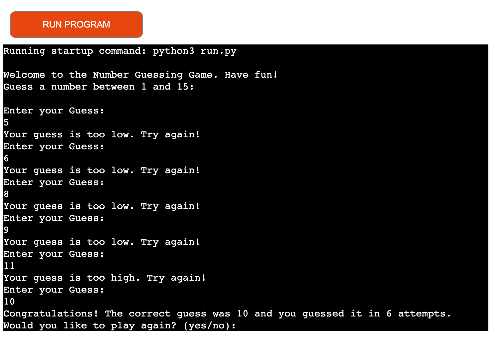

# Number Guessing Game

<strong> Number Guessing Game </strong> is a Python terminal game, which runs in the Code Institute mock terminal on Heroku.

It is a game developed with the excitement of gambling and predicting winning numbers just like betting. It challenges the users to guess a secret number chosen by the computer.

Users can try to predict the computer chosen number by guessing what number the computer has chosen, if they are lucky, they will guess correctly on the first attempt otherwise they keep guessing until guessed correctly.

[Here is the live version of my project](https://numb-guessing-game-e7bd1e907d76.herokuapp.com/)

### How to play

This Number Guessing Game is based on the classic secret number game where the computer selects a secret number, and the user player tries to guess within number of attempts (unlimited number of attempts to make it fun) with constant feedback on whether the guess is too high or too low.

#### Game Objective:
Is to guess the secret number chosen by the computer.

- Your code must be placed in the `run.py` file
- Your dependencies must be placed in the `requirements.txt` file
- Do not edit any of the other files or your code may not deploy properly

## Creating the Heroku app

When you create the app, you will need to add two buildpacks from the _Settings_ tab. The ordering is as follows:

1. `heroku/python`
2. `heroku/nodejs`

You must then create a _Config Var_ called `PORT`. Set this to `8000`

