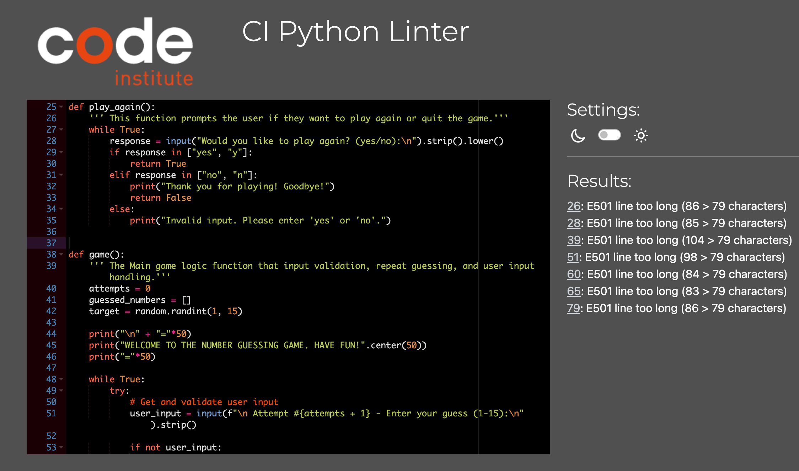

# Number Guessing Game

<strong> Number Guessing Game </strong> is a Python terminal game, which runs in the Code Institute mock terminal on Heroku.

It is a game developed with the excitement of gambling and predicting winning numbers just like betting. It challenges the users to guess a secret number chosen by the computer.

Users can try to predict the computer chosen number by guessing what number the computer has chosen, if they are lucky, they will guess correctly on the first attempt otherwise they keep guessing until guessed correctly.

[Here is the live version of my project](https://numb-guessing-game-e7bd1e907d76.herokuapp.com/)

### How to play

This Number Guessing Game is based on the classic secret number game where the computer selects a secret number, and the user player tries to guess within number of attempts (unlimited number of attempts to make it fun) with constant feedback on whether the guess is too high or too low.

### Game Objective:
Is to guess the secret number chosen by the computer.

### Features

#### Existing Features
- Random number generation
    - Computer randomly choose a secret number
    - The player cannot see what number the computer has chosen
    - The player guess the secret number by inputting a number
    - Accepts user input
    - Check user input and compare with computer's secret number to determine whether it's a correct guess.
    - Counts the number of user attempts to guess the number

- Input validation and error-checking
    - A user must enter a number
    - You cannot enter letters, strictly numbers
    - Game over if anything aside number is input
    - Prompt user whether they like to play again by input yes or no
    - If chose `no` the game is aborted with a thank you message

## Data model
The program uses input() function to get the user's choices and a series of validation functions to ensure that the user inputs are valid for the game.

## Technologies used

### Language
#### Main Language

- Python: programming language for the project

#### Other Languages
- JavaScript
- CSS
- HTML

### Programs used
- VSCODE: IDE used for version control and writing code
- Git: version control system used for managing and tracking changes to the project's codebase
- GitHub: web-based hosting service used for version control and storing the project's code after being pushed from VSCODE
- Heroku: cloud platform used for deploying and hosting the project's web application

## Testing

I have manually tested this project by doing the following:

- Passed the code through the Python PEP8 linter and confirmed there are no major problems
- Given invalid inputs such as strings when numbers are expected, out of bounds inputs
- Tested in my local terminal and Code Institute Heroku terminal

## Bugs
#### Solved Bugs
- During the time of writing this project, I was getting ValueBased literal Errors because I had forgotten that the I need to convert the user input to integer to work with the computer randomly selected numbers. I fixed this by using int() round the input() prompt where necessary.

- My While loop function was returning the wrong result because I hadn't structured the `if` statement in the loop properly.

- My image documentation isn't showing despite working and readjusting the file path from the assets folder until I worked on the file path manually.

## Remaining Bugs
- No bugs remaining except the long line of the words by Python

## Validator Testing

- No errors were recorded from the PEP8 Python Online

## Deployment
To deploy this project, follow these steps:

1. Fork and clone this repository to your local machine.
2. Create a new Heroku app.
3. In the Heroku dashboard, navigate to the app's settings and set the buildpacks to `Python` and `NodeJS` in that order.
4. Connect your Heroku app to the repository by linking it to your forked copy of the repository.
5. Click on the <strong>"Deploy"</strong> button in the Heroku dashboard.

After following these steps, your app should be successfully deployed to Heroku. 

## Credits

- Code Institute for the deployment terminal and mockups
- Heroku for the deployment

